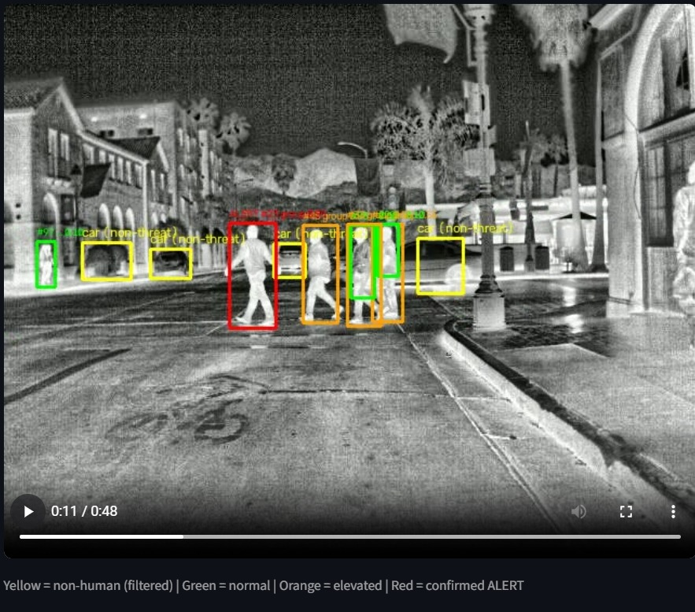
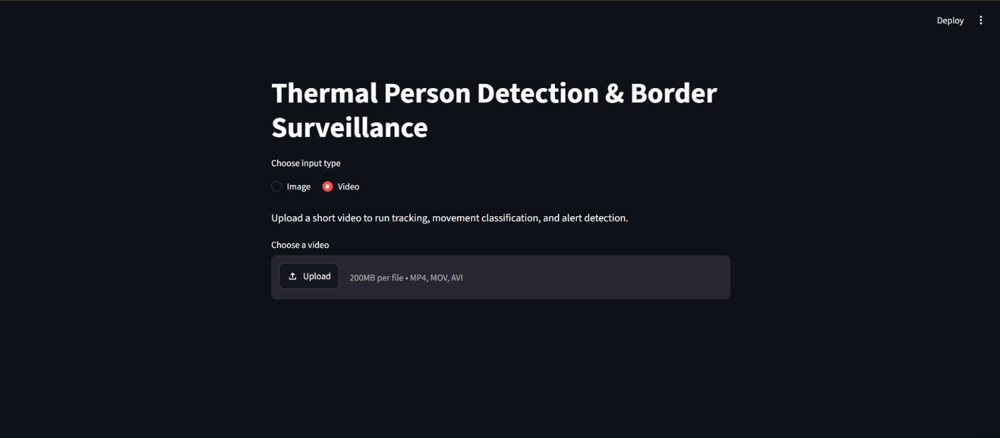
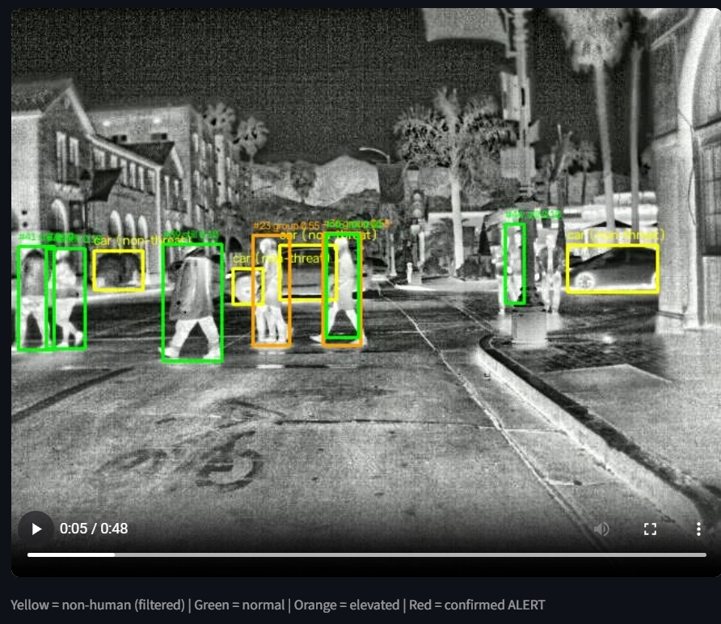
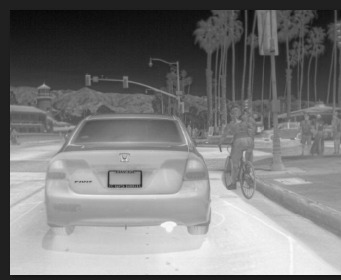
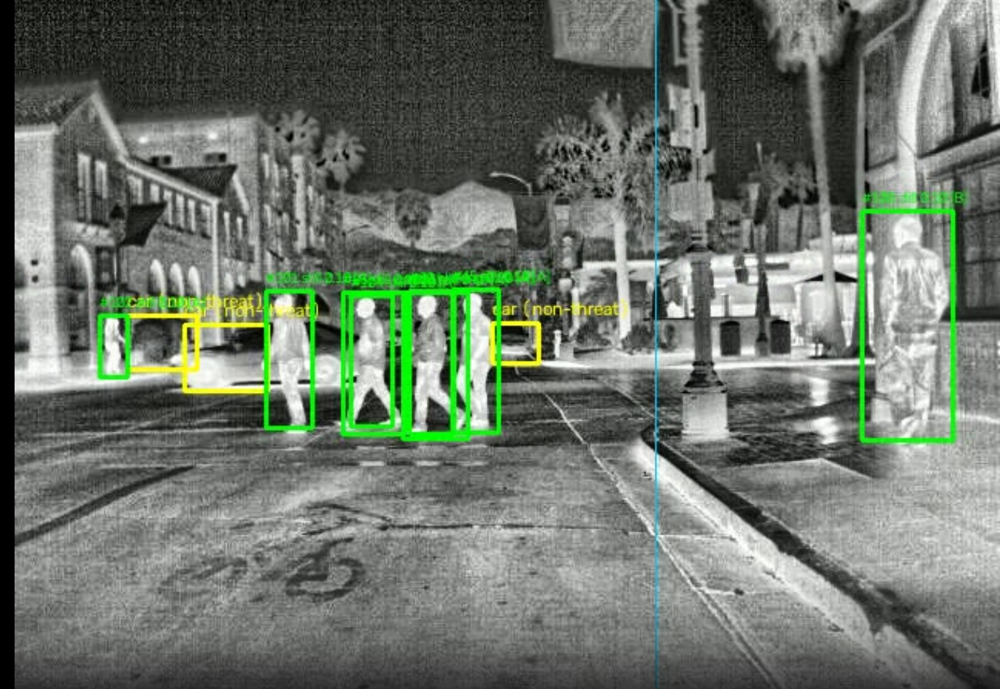
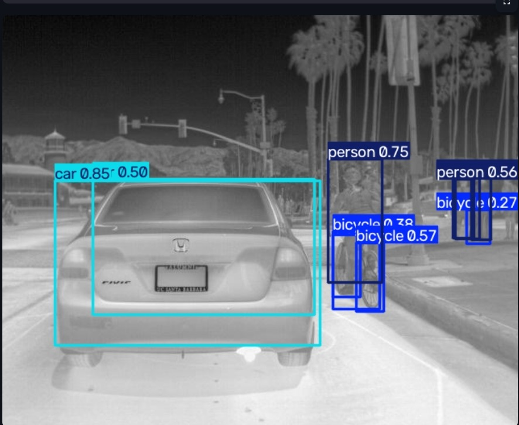

# AI-Based Border Surveillance Using Drones (Thermal Person Detection & Behavior Classification)

Built for Hacker's Cult NSUT Hackathon — AI-3 track (Computer Vision / Security Tech)

## Problem

Manual border/perimeter monitoring is manpower-intensive and prone to fatigue-driven misses,
especially at night. This project processes thermal and low-light video to detect people,
track them across frames, classify their movement behavior, and flag suspicious activity —
distinguishing genuine threats from routine non-human heat sources (vehicles, etc.), not just
detecting "something is there."

## Dataset

- **FLIR Thermal Dataset** (v1i, YOLOv8 format, via Roboflow) — public thermal imagery with
  person/car/bicycle annotations.
- **Limitation:** the dataset is relatively small and imbalanced toward vehicles over people,
  and thermal imagery has inherently lower resolution and no color/texture cues compared to
  RGB data — addressed via CLAHE contrast enhancement (see below).

## Approach

1. **Detection** — YOLOv8n fine-tuned on the FLIR thermal dataset (25 epochs, CPU-trained).
2. **Tracking** — ByteTrack (via Ultralytics) assigns persistent IDs to each person across
   video frames, handling partial occlusion.
3. **Thermal preprocessing** — CLAHE (Contrast Limited Adaptive Histogram Equalization) is
   applied to each frame before detection, to counteract thermal blooming and low contrast.
4. **Movement classification (rule-based, not a separately trained model)** — using each
   tracked person's motion history:
   - **Crouching/crawling** — bounding box height/width ratio drops well below that person's
     own established baseline
   - **Group movement** — 2+ people close together, moving in the same direction at similar
     speed
   - **Normal walking** — default movement; **stationary** if barely moving
5. **False-alarm reduction (2 techniques):**
   - Non-human classes (car, bicycle) are explicitly detected and labeled "non-threat
     (filtered)" rather than ignored
   - Suspicious behavior must persist for several consecutive frames before becoming a
     confirmed **ALERT** — a single noisy frame won't trigger a false alarm
6. **Multi-camera fusion (simulated, disclosed):** true multi-physical-camera fusion is a
   research-level problem outside hackathon scope. This is a disclosed simulation: the video
   frame is split into two overlapping "virtual camera" zones; a person seen in the overlap
   zone is treated as cross-camera confirmed, with a suspicion-confidence boost — demonstrating
   the actual fusion decision logic on a single real feed.
7. **Output** — bounding-box-and-alert overlay directly on the video (not a terminal log),
   with a live confidence/suspicion score per tracked person.

## Results

- Training: 25 epochs, YOLOv8n, CPU, ~4.7 hours
- Visually confirmed accurate person/vehicle detection on validation images and real video
  footage (see `/demo_screenshots`)
- Note: the automated mAP metric reported at the end of training was affected by an unrelated
  library bug (`polars`) and did not reflect true performance — validated instead via direct
  visual inspection of predictions on held-out images and video.

## Honest limitations

- Movement classification is rule-based/heuristic, not a separately trained and validated
  classifier — a reasonable approach given the time constraints, but not empirically validated
  against ground-truth behavior labels.
- Detection confidence is moderate (typically 0.2–0.9), consistent with a small (`yolov8n`)
  model trained briefly on CPU.
- Multi-camera fusion is simulated on a single feed, not tested with genuine multi-camera
  hardware.

## Demo

- Streamlit app (`app.py`) — supports both single-image and full video pipeline (tracking +
  classification + alerts) with a live browser demo.
- Standalone script (`track_analyze.py`) — same full pipeline, run from the command line on
  any video file.

### Demo Screenshots

| | |
|---|---|
|  |  |
|  |  |
|  |  |

## Setup

```bash
pip install -r requirements.txt
python -m streamlit run app.py
```

## Files

- `train.py` — model training script
- `resume.py` — resume training from a checkpoint
- `track_analyze.py` — full detection + tracking + classification + alert pipeline (CLI)
- `app.py` — Streamlit demo (image and video modes)
- `make_demo_video.py` — utility to synthesize a demo video from dataset images
- `data.yaml` — dataset config
